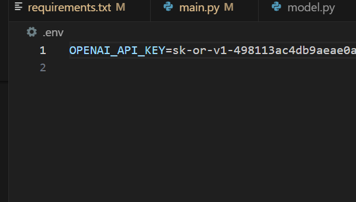
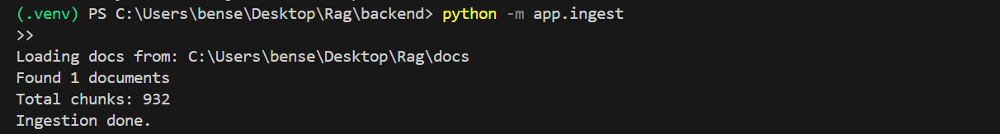
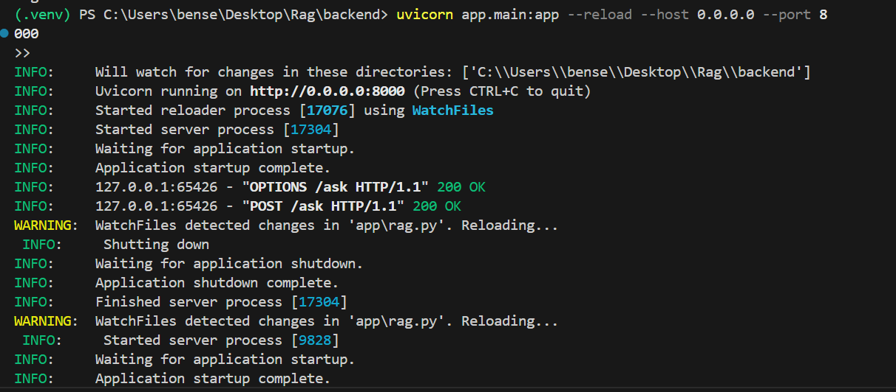
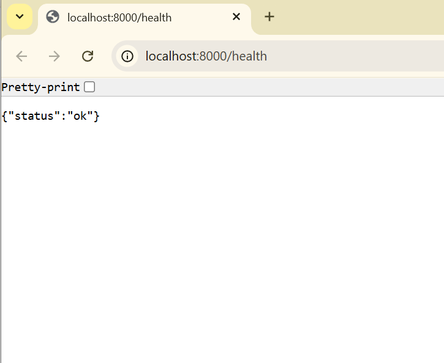
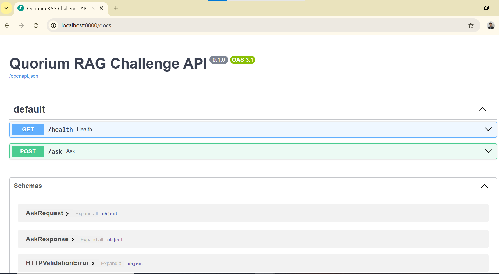
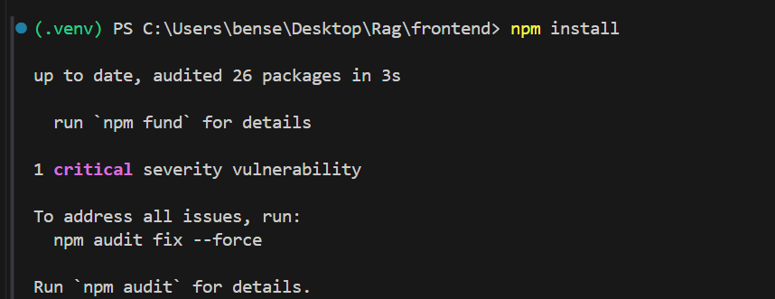
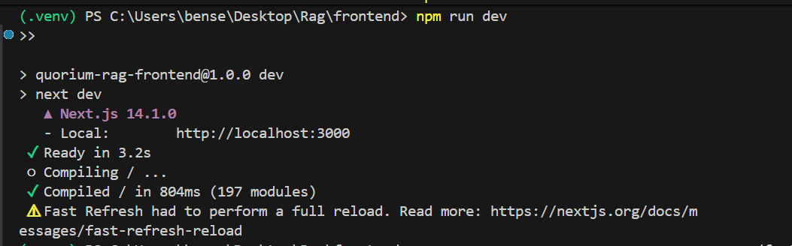
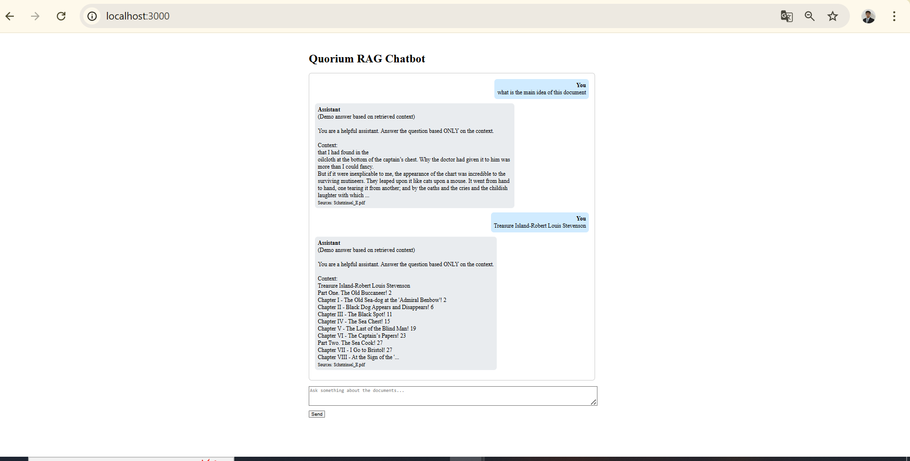
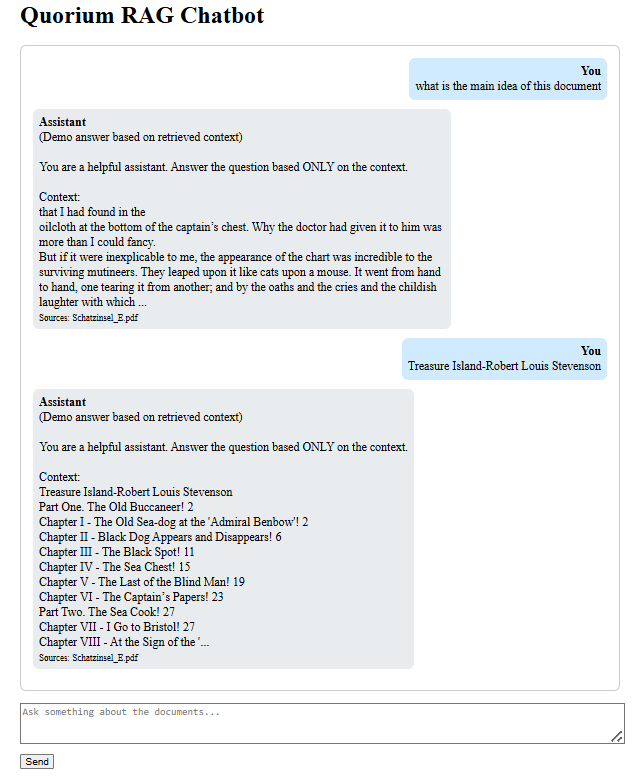

# Quorium RAG Challenge – Student Project

This is my solution for the **Quorium AI Engineer Trainee – RAG coding challenge**.

The goal:  
Build a small RAG (Retrieval-Augmented Generation) app that can answer questions about a set of documents (for example `Schatzinsel_E.pdf`) using:

- a Python **backend** (FastAPI)
- a **vector database** (Chroma)
- a simple **chat frontend** (Next.js / React)
- optional **OpenAI** model for generation

---

## 1. How the project is organized

Project folders:

```text
backend/   # FastAPI, ingestion, RAG logic, tests
frontend/  # Next.js chat UI
docs/      # PDF / TXT / MD documents to ingest
docker.sh
docker-compose.yml
README.md
Backend structure:

text
Copy code
backend/app/
  __init__.py
  config.py      # paths, load .env, config
  ingest.py      # read docs/, chunk them, store in Chroma
  rag.py         # RAG pipeline (retrieve + generate)
  models.py      # Pydantic request/response models
  main.py        # FastAPI app, /health and /ask
backend/tests/
  test_rag.py
2. What the app does
I put documents (like Schatzinsel_E.pdf) into the docs/ folder.

I run an ingestion script which:

reads the files

splits them into overlapping chunks

saves them into a Chroma vector store

The backend exposes:

http
Copy code
POST /ask
{
  "question": "..."
}
=>
{
  "answer": "...",
  "sources": ["Schatzinsel_E.pdf"]
}
The frontend is a simple chat page:

I type a question

The page calls the backend /ask

It shows the answer and the list of source documents

If I set an OPENAI_API_KEY, the answer is generated using gpt-4o-mini.
If I don’t set a key, the backend returns a demo answer that shows the retrieved context, so you can still see that retrieval works.

3. Getting started (local)
3.1 Requirements
Python 3.11+

Node.js 18+ (with npm)

(Optional) Docker

3.2 Clone and create venv
bash
Copy code
git clone <your-repo-url>
cd <your-repo-folder>

python -m venv .venv
# Windows PowerShell:
.\.venv\Scripts\Activate.ps1

3.3 Install backend packages
bash
Copy code
cd backend
pip install -r requirements.txt
'fastapi
uvicorn[standard]
pydantic
chromadb
sentence-transformers
pypdf
python-dotenv
requests
pytest
'
cd ..
3.4 Put documents in docs/
Example:

text
Copy code
docs/
  Schatzinsel_E.pdf
3.5 (Optional) set OpenAI key
Create a file .env at the project root:

env
Copy code
OPENAI_API_KEY=sk-xxxxxxxxxxxxxxxxxxxxxxxx
If you skip this, the app still runs, but you’ll see the text
(Demo answer based on retrieved context) in the answer.


4. Run the backend
From the project root:

bash
Copy code
# activate venv if not already active
.\.venv\Scripts\Activate.ps1

cd backend

# 1) ingest docs (do this again if you change docs/)
python -m app.ingest


# 2) start FastAPI
uvicorn app.main:app --reload --host 0.0.0.0 --port 8000

Check:

http://localhost:8000/health → should return {"status": "ok"}


http://localhost:8000/docs → Swagger page with /ask endpoint

5. Run the frontend
Open a second terminal:

bash
Copy code
cd frontend

npm install     # first time only


npm run dev


Frontend will be on:

http://localhost:3000


You can now ask questions in the UI.

